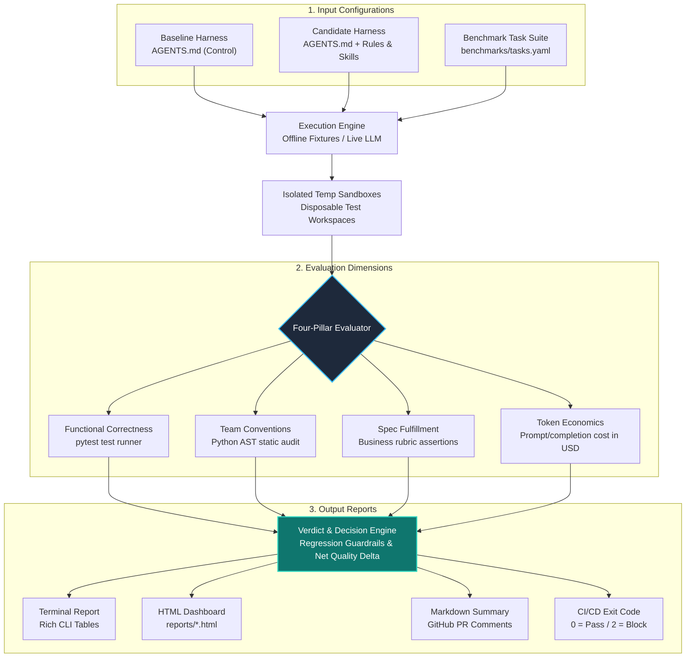
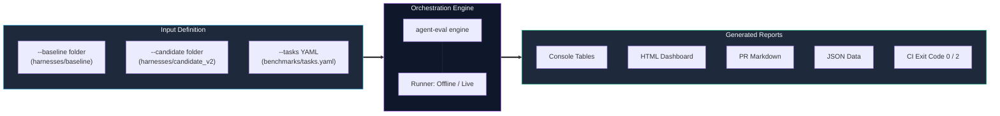

# agent-eval: Harness Evaluation Tool for Coding Agents

[]()
[]()
[]()

> **Evidence-based trust for your coding agent harness.**  
> Know definitively whether a change to `AGENTS.md`, rules, skills, MCPs, or models improves code quality before rolling it out to your engineering team.

---

## The Problem

Engineering teams delegate code implementation to coding agents (Claude Code, Codex, Cursor, etc.). To improve quality, they continuously iterate on their agent harness: updating `AGENTS.md`, writing custom skills, defining rules, configuring MCP tools, or switching models.

However, **teams rarely evaluate whether a change to the harness actually improves code quality**. Quality is multifaceted:
* **The code works**: It runs and passes automated unit tests.
* **It follows team conventions**: It adheres to type safety, error hierarchies, and security invariants.
* **It fulfills business specifications**: It handles edge cases and boundary conditions.
* **It is cost-efficient**: It does not burn through token budgets with bloated instructions.

`agent-eval` replaces opinions and anecdotal spot-checks with a reproducible evaluation pipeline that produces evidence-based verdicts: **POSITIVE (Safe to Ship)**, **NEGATIVE (Reject)**, or **INCONCLUSIVE (Needs More Data)**.

---

## Architecture & Evaluation Pipeline



---

## How Inputs and Outputs Work



### 1. Providing Inputs via CLI
The evaluation engine takes two primary inputs:
* **Harness Configurations (`--baseline` & `--candidate`)**:
  * Directories containing the agent instructions and rules.
  * E.g., baseline `AGENTS.md` vs. candidate `AGENTS.md` with new `rules/typing.md`, `rules/security.md`, and defensive coding skills.
* **Benchmark Tasks (`--tasks benchmarks/tasks.yaml`)**:
  * Each task defines:
    1. **Task Description / Prompt**: The user request dispatched to the agent.
    2. **Starter Code**: Initial template code provided to the agent.
    3. **Automated Test Suite**: Pytest assertions verifying runtime correctness.
    4. **Rubrics & Conventions**: AST criteria for type hints, error handling hierarchies, and security validations.
* **Execution Mode**:
  * **Offline Mode (Default)**: Replays realistic recorded agent outputs (`--fixtures`) in seconds with **zero API keys**.
  * **Live Mode (`--live --model gpt-4o`)**: Calls LLM APIs in real time.

---

### 2. Multi-Format Output Generation
When an evaluation finishes, the tool generates four synchronized output formats:
1. **Interactive Terminal Report**: High-level KPI tables, dimensional deltas, per-task comparison matrix, and verdict banner.
2. **Interactive HTML Dashboard (`reports/eval_report.html`)**: Standalone dark-mode dashboard with interactive tabs, failure logs, and AST violation lists.
3. **Markdown Report (`reports/eval_report.md`)**: GitHub-flavored markdown export for PR summaries.
4. **Machine-Readable JSON (`reports/eval_report.json`)**: Structured data for CI/CD metrics.
5. **Automated CI Exit Code**: Returns `0` on success, or `2` when `--fail-on-regression` is enabled and any quality regression is caught.

---

## Quickstart (Zero Setup, No API Key Required!)

The repository includes pre-recorded, realistic offline fixtures that execute deterministically in seconds:

```bash
# Run the default evaluation pipeline (Baseline vs Candidate v2)
python evaluate.py
```

Or run the full comparative demo highlighting both positive and negative scenarios:

```bash
python run_demo.py
```

### Installation

```bash
# Install in editable mode
pip install -e .

# Run via CLI
agent-eval evaluate
```

---

## Real Example Walkthrough

### Scenario 1: Positive Harness Change (Candidate v2)
We compare `harnesses/baseline` against `harnesses/candidate_v2`:
* **Changes in Candidate v2**: Structured `AGENTS.md`, strict typing rules, domain exception hierarchy requirements, SQL injection security rules, and defensive coding skills.

```bash
python evaluate.py evaluate --baseline harnesses/baseline --candidate harnesses/candidate_v2
```

**Results:**
* **Verdict**: `POSITIVE`
* **Functional Correctness**: **+42.5%** test pass rate improvement (51.2% -> 93.8%).
* **Convention Adherence**: **+37.5%** compliance (zero bare `except:`, complete type annotations).
* **Business Spec Fulfillment**: **+41.7%** (sliding window expiration, idempotency key verification, parameterization).
* **Net Quality Impact Score**: **+41.0 pts**
* **Token Variance**: +42.1% (efficiently justified by the quality leap).
* **Generated Reports**: `reports/eval_report_positive.html` | `reports/eval_report_positive.md`

---

### Scenario 2: Detecting a Regressive Change (Candidate Regressive)
We evaluate `harnesses/candidate_regressive`, which introduced 500 lines of prompt bloat, confusing exception rules, and bad SQL formatting patterns:

```bash
python evaluate.py evaluate --baseline harnesses/baseline --candidate harnesses/candidate_regressive
```

**Results:**
* **Verdict**: `NEGATIVE`
* **Guardrail Triggered**: Critical functional regression on 3 tasks (Rate Limiter -50%, Payment Retry -50%, Pagination -40%).
* **Token Overhead**: **+372.3%** token explosion (18,130 wasted tokens) with net quality drop (-27.4 pts).
* **Recommendation**: *Do NOT roll out this harness change to engineering teams.*
* **Generated Reports**: `reports/eval_report_negative.html` | `reports/eval_report_negative.md`

---

## CLI Command Reference

```text
Usage: python evaluate.py evaluate [OPTIONS]

Options:
  -b, --baseline PATH       Directory containing baseline harness (AGENTS.md, rules, skills). [default: harnesses/baseline]
  -c, --candidate PATH      Directory containing candidate harness to evaluate. [default: harnesses/candidate_v2]
  -t, --tasks PATH          Path to tasks.yaml benchmark file or benchmark folder. [default: benchmarks/tasks.yaml]
  --fixtures PATH           Path to offline evaluation fixtures. [default: fixtures]
  --live                    Execute live LLM calls instead of deterministic offline fixtures.
  --model TEXT              Model identifier if running in --live mode. [default: gpt-4o]
  --report-html PATH        Output file path for interactive HTML dashboard. [default: reports/eval_report.html]
  --report-md PATH          Output file path for Markdown report. [default: reports/eval_report.md]
  --report-json PATH        Output file path for machine-readable JSON data. [default: reports/eval_report.json]
  --fail-on-regression      Exit with non-zero status if evaluation verdict is NEGATIVE (for CI/CD).
  --help                    Show this message and exit.
```

---

## CI/CD Automated Quality Gate

Prevent broken agent rules from merging to `main` by adding `agent-eval` to your CI pipeline:

```yaml
name: Agent Harness Quality Gate
on:
  pull_request:
    paths:
      - 'AGENTS.md'
      - 'rules/**'
      - 'skills/**'

jobs:
  evaluate-harness:
    runs-on: ubuntu-latest
    steps:
      - uses: actions/checkout@v4
      - uses: actions/setup-python@v5
        with:
          python-version: '3.11'
      - run: pip install -e .
      - name: Run Harness Evaluation
        run: |
          agent-eval evaluate \
            --baseline ./production-harness \
            --candidate ./pr-harness \
            --fail-on-regression
```

If the pull request regresses test pass rates or bloats token cost without quality gains, the step fails with exit code `2`, blocking merge.

---

## Project Structure

```text
agent-eval/
├── README.md                      # Complete system documentation (Deliverable 1)
├── AGENTS.md                      # Harness instructions used to build the tool (Deliverable 5)
├── docs/                          # Core assignment documentation
│   ├── ONE_PAGE_REFLECTION.md     # Deliverable 4: Hard limit 1-page design & reflection
│   └── PROCESS.md                 # Deliverable 5: Process transcript, audit log, error resolutions
├── reports/                       # Generated evaluation reports
│   ├── eval_report_positive.html  # Interactive HTML Dashboard (Positive case)
│   ├── eval_report_negative.html  # Interactive HTML Dashboard (Negative case)
│   ├── eval_report_positive.md    # Markdown Summary (Positive case)
│   └── eval_report_negative.md    # Markdown Summary (Negative case)
├── .agents/skills/
│   └── harness-evaluation/        # Skill definition for agent evaluation
│       └── SKILL.md
├── evaluate.py                    # Root convenience launcher
├── run_demo.py                    # Multi-scenario demo script
├── pyproject.toml                 # Package configuration
├── harness_eval/                  # Core Python Package
│   ├── cli.py                     # Click CLI entrypoint with evaluate command
│   ├── engine.py                  # Evaluation orchestrator
│   ├── models.py                  # Domain models (Harness, Task, Metrics, Verdict)
│   ├── runner.py                  # Runners (OfflineFixtureRunner, LiveLLMRunner)
│   ├── verdict.py                 # Decision engine & regression guardrails
│   ├── metrics/
│   │   ├── functional.py          # Isolated pytest sandbox execution
│   │   ├── convention.py          # AST typing, error handling, and security auditing
│   │   ├── fulfillment.py         # Business spec rubric engine
│   │   └── cost.py                # Token counter & model cost calculation
│   └── reporting/
│       ├── console.py             # Rich terminal report renderer
│       ├── html.py                # Interactive dark-mode HTML dashboard generator
│       └── markdown.py            # GitHub PR Markdown export generator
├── harnesses/                     # Real harnesses for evaluation
│   ├── baseline/                  # Control harness (minimal prompt)
│   ├── candidate_v2/              # Improved harness (rules, typing, skills)
│   └── candidate_regressive/      # Regressive harness (prompt bloat, anti-patterns)
├── benchmarks/                    # Benchmark tasks
│   └── tasks.yaml                 # Task specifications, starter files, tests, rubrics
├── fixtures/                      # Pre-recorded realistic agent outputs
│   ├── baseline/
│   ├── candidate_v2/
│   └── candidate_regressive/
└── tests/                         # Unit test suite for the evaluation tool
    ├── test_engine.py
    ├── test_verdict.py
    ├── test_metrics.py
    └── test_cli.py
```

---

## Assessment Deliverables Cross-Reference

| Deliverable | Description | File Location |
| :--- | :--- | :--- |
| **1. Repository & README** | Runnable tool with real example walkthrough | [README.md](README.md) |
| **2. Evidenced Report** | Multi-dimensional positive/negative impact evidence | [reports/eval_report_positive.html](reports/eval_report_positive.html) & [reports/eval_report_negative.html](reports/eval_report_negative.html) |
| **3. evaluate Command** | Command line tool with reporting & CI gates | `python evaluate.py evaluate` / `agent-eval` |
| **4. One-Page Document** | Hard limit 1 page: concepts, 5 hardest decisions, cuts, trust failure case | [docs/ONE_PAGE_REFLECTION.md](docs/ONE_PAGE_REFLECTION.md) |
| **5. Process & Transcript** | Prompts, manual audit checkpoints, bugs caught & session transcript | [docs/PROCESS.md](docs/PROCESS.md), [AGENTS.md](AGENTS.md), and [.agents/skills/](.agents/skills/harness-evaluation/SKILL.md) |
